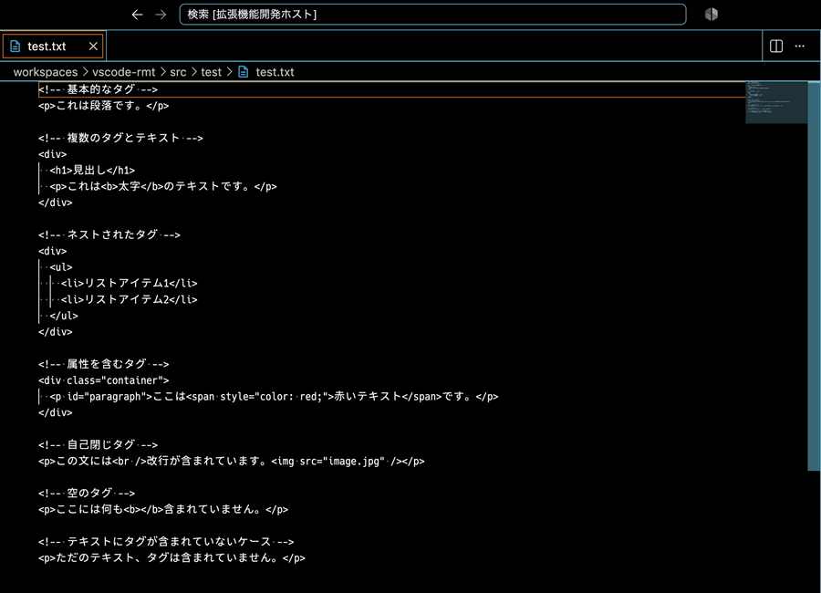

# Remove Markup Tags

[English](README.md) | 日本語

Visual Studio Code で、選択したテキストから HTML/XML のマークアップを取り除き、テキストだけを残す拡張機能です。



## 機能

- タグ・コメント・DOCTYPE・処理命令を、すべての選択範囲（マルチカーソルを含む）から削除します。1 回の Undo で元に戻せます。
- 既定で HTML をプレーンテキストに変換します。`<script>` と `<style>` は中身ごと削除され、`&amp;`、`&lt;`、`&nbsp;`、`&#8212;` などの文字参照はデコードされ、`<br>` は改行になります。それぞれ設定で無効にできます（[設定](#設定) を参照）。
- マークアップでない部分はそのまま残ります。`a < b` のような比較や、コメント・属性値の中の `>` も変わりません。CDATA セクションは中身を残します。
- HTML だけでなく XML にも対応し、非 ASCII の要素名も扱えます。

## 使い方

1. マークアップを含むテキストを選択します。マルチカーソルでも構いません。
2. コマンドパレット（`Ctrl+Shift+P`、macOS では `Cmd+Shift+P`）から **Remove Markup Tags** を実行します。このコマンドは何かを選択している間だけ表示されます。
3. 各選択範囲がテキストの内容に置き換わり、選択は解除されます。元に戻すには Undo を使ってください。

キーを割り当てるには、キーボード ショートカット（`Ctrl+K Ctrl+S`）で `extension.removeMarkupTags` にショートカットを追加してください。

## 設定

| 設定 | 既定値 | 説明 |
| --- | --- | --- |
| `removeMarkupTags.removeScriptAndStyleContent` | `true` | `<script>` と `<style>` をタグだけでなく中身ごと削除します。 |
| `removeMarkupTags.decodeEntities` | `true` | タグの削除後に `&lt;` `&gt;` `&amp;` `&quot;` `&apos;` `&nbsp;` と数値文字参照をデコードします。 |
| `removeMarkupTags.replaceLineBreaks` | `true` | `<br>` を削除する代わりに改行（ドキュメントの改行コードに合わせたもの）に置き換えます。 |

いずれも言語ごとに上書きできます。たとえば HTML のソースを編集中は文字参照をそのまま残したい場合：

```json
"[html]": {
  "removeMarkupTags.decodeEntities": false
}
```

## 制限事項

この拡張機能はドキュメントとして解析するのではなく、テキストそのものを処理します。

- デコードされる名前付き文字参照は上記のものだけです。`&copy;` などその他の名前付き参照はそのまま残ります。数値文字参照は常に動作します。
- 閉じタグのない `<script>` や `<style>` は開始タグだけが削除され、中身は残ります。
- タグのように見えるものはすべて削除されます。ジェネリクスの `<T>` も例外ではありません。

## インストール

拡張機能ビュー（`Ctrl+Shift+X`）で **Remove Markup Tags** を検索するか、クイックオープン（`Ctrl+P`）で `ext install zero3.vscode-rmt` を実行してください。

## 開発

```bash
pnpm install
pnpm test   # コンパイル、lint、Jest のテストを実行
```

`F5` を押すと、サンプルファイルを開いた状態で Extension Development Host が起動します。

## ライセンス

[MIT](LICENSE.md)
